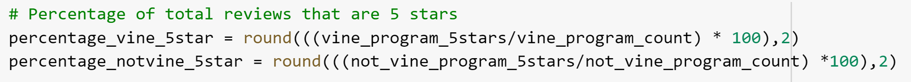

# Amazon Vine Analysis

## Overview

### Background
Amazon receives reviews written by members of a paid Amazon Vine program as well as nonmembers. The vine program allows companies to pay to have their products reviewed.

### Purpose
The purpose of this analysis is to determine if there is any bias toward favorable reviews from vine members compared to non-vine members.

## Results
Vine Program Reviews Dataframe

Not Vine Program Reviews Dataframe

- In the dataset there were 94 total reviews from the vine program, and 40,471 total reviews not from the vine program

- There were a total of 48 5-star reviews from vine members and 15,663 5-star reviews from non-vine members.

- For vine members, the total percentage of 5-star reviews was 51.06%, and for non-vine members it was 38.7%.

Final Output for All Results

## Summary
Based on the analysis there does appear to be some positivity bias for reviews in the vine program. 51.06% 5-star reviews from the vine program vs 38.7% from outside the vine program is a significant difference. The total number of reviews from the vine program is far lower, which could cause some skewing of the data due to a low sample size. Another test, including 4-star reviews would be good to see if the bias tracks to all positive reviews, not just 5-star. 
